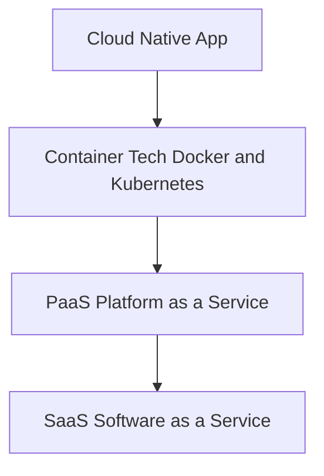

# UTS-CLOUD-SIMEON
Repository untuk pengumpulan jawaban UTS Cloud Computing Simeon Kogoya.
# UTS Cloud Computing – Jawaban

## 1. Keterkaitan antara SaaS, PaaS, dan IaaS dalam *cloud computing*

Dalam cloud computing, SaaS, PaaS, dan IaaS merupakan tiga model layanan utama yang tersusun secara berlapis. Ketiganya saling berhubungan dan digunakan sesuai kebutuhan pengguna.

### **a. IaaS (Infrastructure as a Service)**
IaaS adalah layanan cloud yang menyediakan infrastruktur dasar seperti:
- Virtual machine
- Storage
- Jaringan
- Sistem operasi

Contoh: **AWS EC2**, **Google Compute Engine**, **Azure VM**.

### **b. PaaS (Platform as a Service)**
PaaS adalah layanan platform yang berjalan di atas IaaS. PaaS menyediakan:
- Environment untuk develop aplikasi
- Runtime
- Database
- Tools deployment

Tujuannya agar developer tidak perlu mengelola server dan fokus pada pembangunan aplikasi.

Contoh: **Heroku**, **Google App Engine**, **AWS Elastic Beanstalk**.

### **c. SaaS (Software as a Service)**
SaaS adalah layanan aplikasi siap pakai yang langsung digunakan oleh end-user melalui internet. Pengguna tidak perlu mengelola instalasi, update, maupun infrastruktur.

Contoh: **Gmail**, **Google Drive**, **Office 365**, **Zoom**.

### **Hubungan Ketiga Layanan**

Struktur keterkaitan berlapis:

```
SaaS (Aplikasi Jadi)
↑
PaaS (Platform Aplikasi)
↑
IaaS (Infrastruktur Dasar)
```

- **IaaS** menyediakan infrastruktur dasar.
- **PaaS** berdiri di atas IaaS sebagai platform untuk membangun & deploy aplikasi.
- **SaaS** dibangun di atas PaaS dan digunakan langsung oleh end-user.

---

## 2. Diagram Keterkaitan Cloud Native App, Container, PaaS, dan SaaS




### **Penjelasan Diagram**
- **Cloud Native App**: aplikasi modern yang scalable dan mudah di-deploy.
- **Container Technology**: teknologi seperti Docker dan Kubernetes untuk menjalankan cloud native app.
- **PaaS**: platform yang mengelola container dan memudahkan deployment.
- **SaaS**: hasil akhir berupa aplikasi yang siap digunakan oleh pengguna akhir.

---

